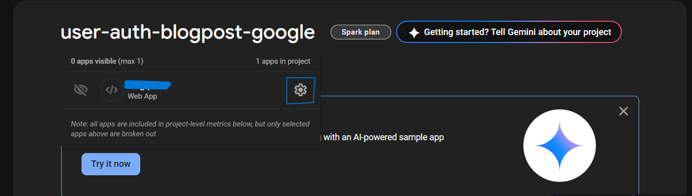
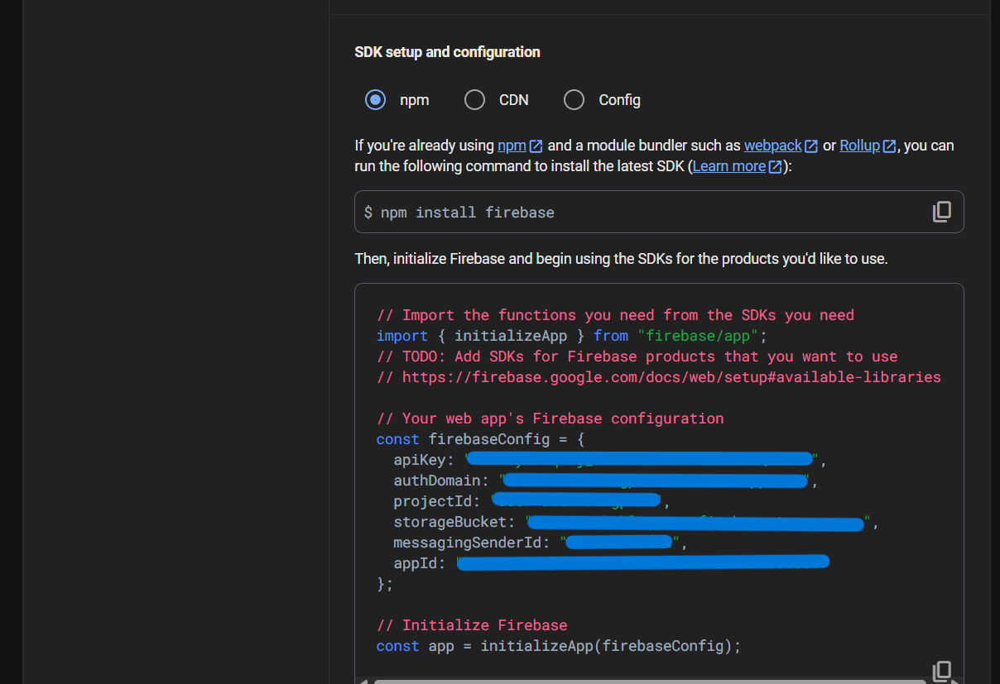
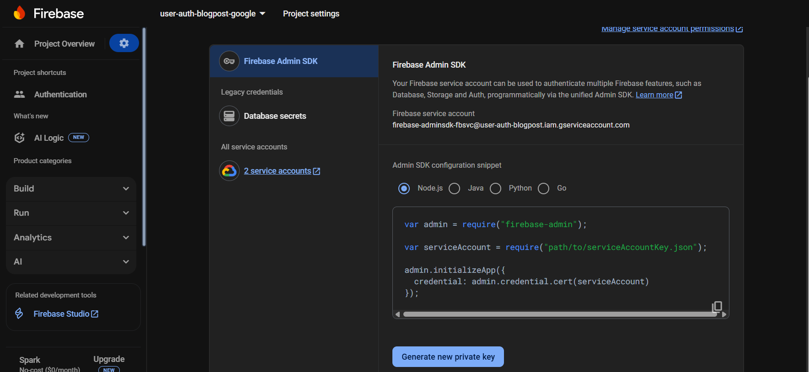
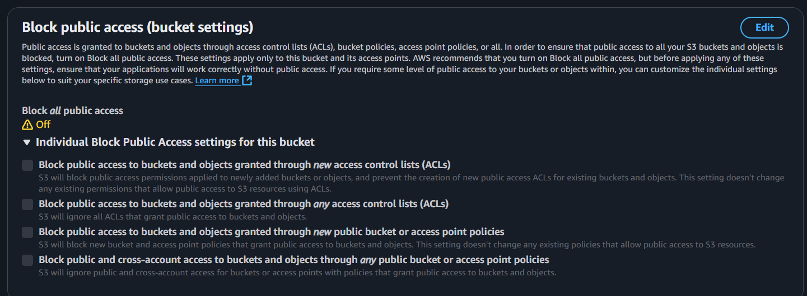
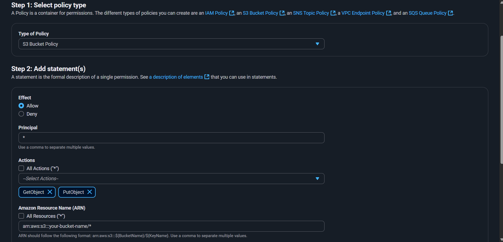
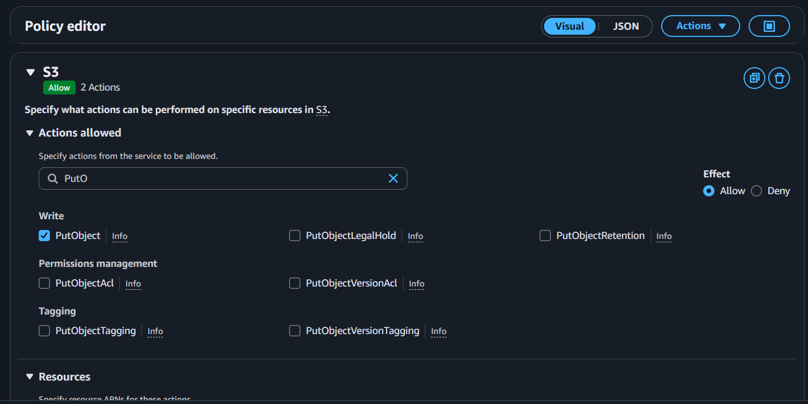
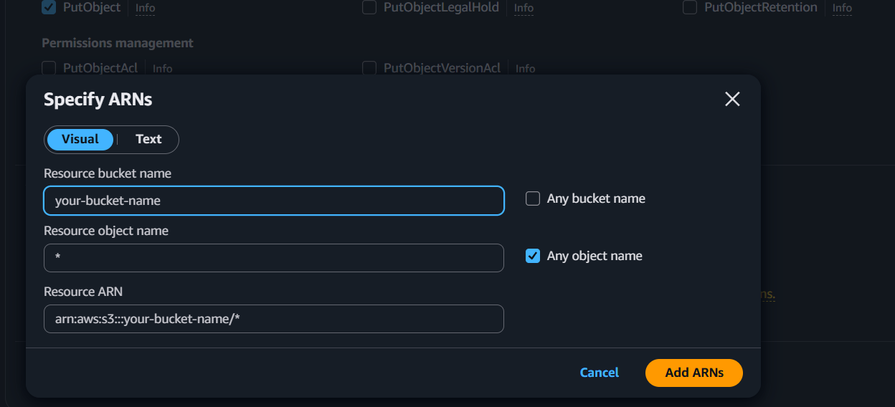
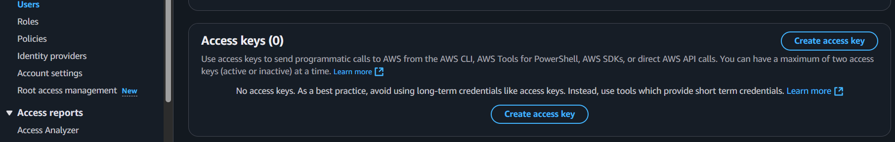
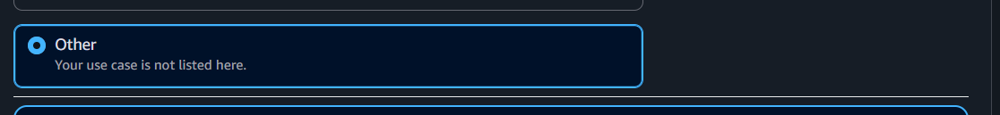
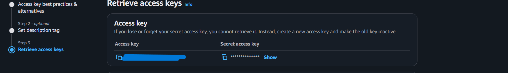

## Open Writer
Open Writer is a minimalist, distraction-free platform tailored for both writers and readers. Developed for educational purposes, it exemplifies how to build a full-stack web application using React, Node.js, and MongoDB. The project focuses on providing a smooth user experience with core features.
## Features
- **Blog Management**: Create, edit, and delete blogs with ease.
- **User Authentication**: Secure login and registration system.
- **Real-time Notifications**: Stay updated with instant notifications.
- **Like and Comment Functionality**: Engage with content through likes and comments.
- **Write Blog with Different Styles**: Use various styles to enhance blog writing.
- **Responsive Design**: Optimized for both desktop and mobile devices.
- **Dark Mode**: Toggle between light and dark themes for user comfort.
- **Search Functionality**: Easily find blogs using a search bar.
- **User Profiles**: View and manage user profiles with personal information.
- 
## Tech Stack
- **Frontend**: React, Tailwind CSS
- **Backend**: Node.js, Express.js
- **Database**: MongoDB
- **Storage**: AWS S3 for file storage
- **Authentication**: JWT (JSON Web Tokens) with cookie,Firebase authentication,
- **Deployment**: Vercel for frontend, Render for backend

## Installation
1. Clone the repository:
   ```bash
   git clone https://github.com/animeshmaiti/Blog-Posts.git
   ```
2. Navigate to the project directory:
    ```bash
    cd Blog-Posts
    ```
3. Install dependencies for both frontend and backend:
    ```bash
    npm i
    ```
4. Set up environment variables:
   - Create a `.env` file in both of the root directory (frontend & backend) and add the necessary environment variables for
   - Frontend:<br>
        ```env
        VITE_FIREBASE_API_KEY="your firebase api key"
        VITE_FIREBASE_AUTH_DOMAIN="your firebase auth domain"
        VITE_FIREBASE_PROJECT_ID="your firebase project id"
        VITE_FIREBASE_STORAGE_BUCKET="your firebase storage bucket"
        VITE_FIREBASE_MESSAGING_SENDER_ID="your firebase messaging sender id"
        VITE_FIREBASE_APP_ID="your firebase app id"

        VITE_BACKEND_URL="http://localhost:5000" # or your backend URL
        ```
    - Backend:<br>
        ```env
            MONGO_URI="your mongodb uri"
            PORT=3000
            JWT_SECRET="your jwt secret"
            NODE_ENV=development

            FIREBASE_TYPE= account type
            FIREBASE_PROJECT_ID= your firebase project id
            FIREBASE_PRIVATE_KEY_ID= your firebase private key id
            FIREBASE_PRIVATE_KEY= your firebase privatekey
            FIREBASE_CLIENT_EMAIL= your firebase client email
            FIREBASE_CLIENT_ID= your firebase client id
            FIREBASE_AUTH_URI=https://accounts.google.com/o/oauth2/auth
            FIREBASE_TOKEN_URI=https://oauth2.googleapis.com/token
            FIREBASE_AUTH_PROVIDER_X509_CERT_URL=https://www.googleapis.com/oauth2/v1/certs
            FIREBASE_CLIENT_X509_CERT_URL= your firebase client x509 cert url
            FIREBASE_UNIVERSE_DOMAIN=googleapis.com

            AWS_ACCESS_KEY_ID= your aws access key id
            AWS_SECRET_ACCESS_KEY= your aws secret access key
            AWS_REGION=ap-south-1
        ```
5. Set up firebase:
   - Create a Firebase project and enable authentication.
   - Add your Firebase configuration to the `.env` file as shown above.
   - frontend:<br>
    <br>
   - Go to Firebase Console > Project Settings > General > Your apps > Add app > Web <br>
   <br>
   - Backend:
   - Go to Firebase Console > Project Settings > Service accounts > Generate new private key. in json file all the credentials are present <br>
    <br>
6. Set up AWS S3:
   - Create an S3 bucket and configure it for public access.
   - Add your AWS credentials to the `.env` file as shown above.
   - Backend:
   - Create an AWS free tire account and create a bucket in S3.
   - Go to AWS Management Console > S3 > Create bucket
   - After creating the bucket, go to the bucket's permissions tab and off the `Block all public access`.<br>
    <br>
   - Set bucket policy to allow public access:
   - Edit bucket policy in the S3 bucket permissions tab and go to generate bucket policy and paste the following code, replacing `your-bucket-name` with your actual bucket name:<br>
    <br>
   ```json
   {
    "Version": "2012-10-17",
    "Id": "GeneratedPolicyId",
    "Statement": [
        {
            "Sid": "GeneratedStatementId",
            "Effect": "Allow",
            "Principal": "*",
            "Action": [
                "s3:GetObject",
                "s3:PutObject"
            ],
            "Resource": "arn:aws:s3:::your-bucket-name/*"
        }
    ]
   }
   ```
   - Bucket CORS configuration:<br>
   ```json
   [
    {
        "AllowedHeaders": ["*"],
        "AllowedMethods": ["GET", "PUT", "POST"],
        "AllowedOrigins": ["*"],
        "ExposeHeaders": []
    }
   ]
   ```
   - After Setting up the bucket got to IAM > Policies > Create Policy > select service S3 and add the following permissions:
     - search action and select `s3:GetObject` and `s3:PutObject` then at Resources Specify ARNs. Add Arns
     - create the policy and attach it to the user you will create in IAM.
    <br>
    <br>
   ```json
   {
    "Version": "2012-10-17",
    "Statement": [
        {
            "Effect": "Allow",
            "Action": [
                "s3:GetObject",
                "s3:PutObject"
            ],
            "Resource": "arn:aws:s3:::your-bucket-name/*"
        }
    ]
   }
   ```
   - Go to IAM > Users > Create user > Programmatic access > Attach existing policies directly
   - after creating the user, go to user > Security credentials > Create access key > Download the CSV file containing your AWS Access Key ID and Secret Access Key.<br>
  <br>
  <br>
  <br>
1. Start the backend server from the backend root directory:<br>
   ```bash
    npm start
   ```
2. Start the frontend server from the frontend root directory:<br>
   ```bash
    npm run dev
   ```
3. Open your browser and navigate to `http://localhost:5173` to access the application.
4.  For deployment, follow the instructions in the respective sections below.
    - in backend utils/generateToken.js file<br>
    ```js
        res.cookie("token", token, {
        httpOnly: true,// client side js cannot access the cookie prevents xss attack
        sameSite: "strict",// CSRF attack
        maxAge: 15* 24 * 60 * 60 * 1000, // 15 day in milliseconds
        secure: process.env.NODE_ENV === "production" ? true : false // if in production then secure is true, otherwise false
    });
    ```
    - server.js file replace origin with your frontend url (deployed)<br>
    ```js
    server.use(cors({
    origin: 'http://localhost:5173',
    methods: ['GET', 'POST', 'PUT', 'DELETE'],
    credentials: true,
    }));
    ```
    - in frontend replace the backend url with your backend url (deployed)<br>
    ```env
    VITE_BACKEND_URL="https://your-backend-url.com/api"
    ```
### Note:
i only allowed admin users can only create,edit,manage blogs others feature are available for all users. I did this to prevent spam and misuse of the platform. Because im running this on free platforms like aws free tire,render free, vercal free so if spam happens it will exceed my free tire in aws and cost me money. You can change this behavior in the backend code if you want to allow all users to create blogs. Follow the instruction:
 - in backend/Schema/User.js file you can remove this or change the default value to true or if you want to allow a specific user/s to create blogs you can set the admin property to true in the mongoDB database for that user.<br>
 ```js
    admin:{
        type:Boolean,
        default: false
    },
 ``` 
Deployed Link:
https://open-writer-sigma.vercel.app